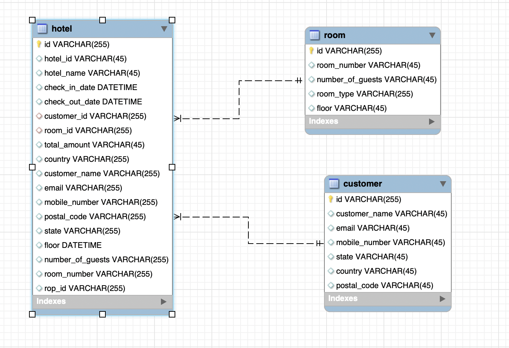
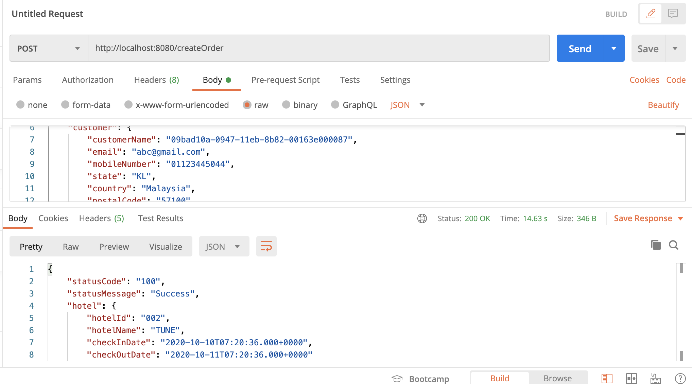

# hotel-create-order
* please clone the code in to your local
* change the database uname/pwd according to your local
* use the command to run mvn spring-boot:run 
###### Database structure

use postman to send a request for token http://localhost:8080/createOrder please see images below

######TestCoverage

######SQL

######Asumptions
* customer will choose room and dates and fill the details to to create order.
* my asumption is securtity is already implemented

